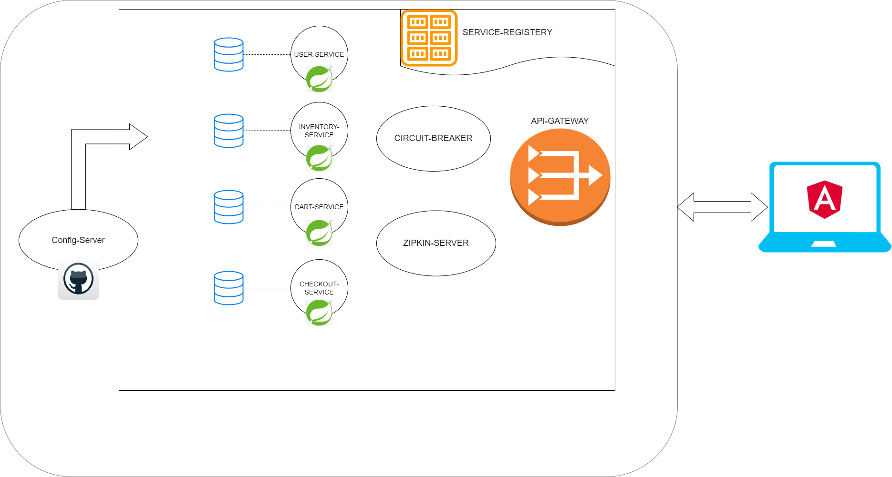

# Bookstore μServices 


## Getting started
### System components Structure
```
Bookstore μService --> Parent folder.
    |- api-gateway --> API Gateway server
    |- service-discovery --> Service Registery server
    |- cloud-config --> Centralized Configuration server
    |- user-service --> Manages user-related functionalities such as user registration and user information.
    |- inventory-service --> Handles book-related operations, including fetching book details and managing inventory.
    |- search-service --> Provides search capabilities for books based on various criteria
    |- cart-service --> Manages shopping cart operations, allowing users to add/remove items.
    |- checkout-service --> Handles the checkout process, including payment and updating purchase history.
```

### System Boundary *Architecture* - μServices Landscape



### Required software

The following are the initially required software pieces:

1. **Java 11**: JDK 11 LTS can be downloaded and installed from https://www.oracle.com/java/technologies/javase/jdk11-archive-downloads.html

1. **Git**: it can be downloaded and installed from https://git-scm.com/downloads

1. **Maven**: Apache Maven is a software project management and comprehension tool, it can be downloaded from here https://maven.apache.org/download.cgi

1. **curl**: this command-line tool for testing HTTP-based APIs can be downloaded and installed from https://curl.haxx.se/download.html

1. **jq**: This command-line JSON processor can be downloaded and installed from https://stedolan.github.io/jq/download/

1. **Spring Boot Initializer**: This *Initializer* generates *spring* boot project with just what you need to start quickly! Start from here https://start.spring.io/


Follow the installation guide for each software website link and check your software versions from the command line to verify that they are all installed correctly.

## Configuration Files

Navigate to the configuration directories of each microservice (e.g., user-service/src/main/resources, book-service/src/main/resources, etc.).
Update the application.yaml.

## Build Microservices:

Build each microservice using Maven:
E.g:
cd user-service
mvn clean install

cd ../book-service
mvn clean install

# Accessing Microservices:

Each microservice should be accessible via its respective port.
User Microservice: http://localhost:8700
Inventory Microservice: http://localhost:8800
Search Microservice: http://localhost:1700
Cart Microservice: http://localhost:8500
Checkout Microservice: http://localhost:8400
Gateway Microservice: http://localhost:8080
Service Discovery Microservice: http://localhost:8761
Cloud Config Microservice: http://localhost:9296

### Cloning It

The first thing to do is to open **git bash** command line, and then simply you can clone the project under any of your favorite places as the following:

```bash
> git clone https://github.com/olutayopeter/bookstore.git
```

### Build & Test Them In Isolation

Access the Gateway Microservice to interact with the system.
Utilize API endpoints defined in the microservices for various functionalities.


```bash
---------------< bookstore >-----------
[INFO] ------------------------------------------------------------------------
[INFO] Reactor Summary for bookstore:
[INFO] 
[INFO] bookstore ..................... SUCCESS [  0.548 s]
[INFO] service-discovery .................................. SUCCESS [  3.126 s]
[INFO] cloud-config ....................................... SUCCESS [  1.595 s]
[INFO] api-gateway ........................................ SUCCESS [  1.697 s]
[INFO] user-service ....................................... SUCCESS [  2.546 s]
[INFO] inventory-service .................................. SUCCESS [  2.214 s]
[INFO] search-service ..................................... SUCCESS [  2.072 s]
[INFO] cart-service ....................................... SUCCESS [  2.241 s]
[INFO] checkout-service ................................... SUCCESS [  2.197 s]
[INFO] ------------------------------------------------------------------------
[INFO] BUILD SUCCESS
[INFO] ------------------------------------------------------------------------
[INFO] Total time:  24.156 s
[INFO] Finished at: 2023-12-22T19:52:57+01:00
[INFO] ------------------------------------------------------------------------
```

### Access Service Discovery Server (Eureka)
If you would like to access the Eureka service discovery point to this URL [http://localhosts:8761/eureka](https://localhost:8761/eureka) to see all the services registered inside it. 

### Access user-service APIs
 URL [https://localhost:8700/swagger-ui.html](https://localhost:8700/swagger-ui.html).


### Postman Collection
I have provided postman collection for all the test carried out.

